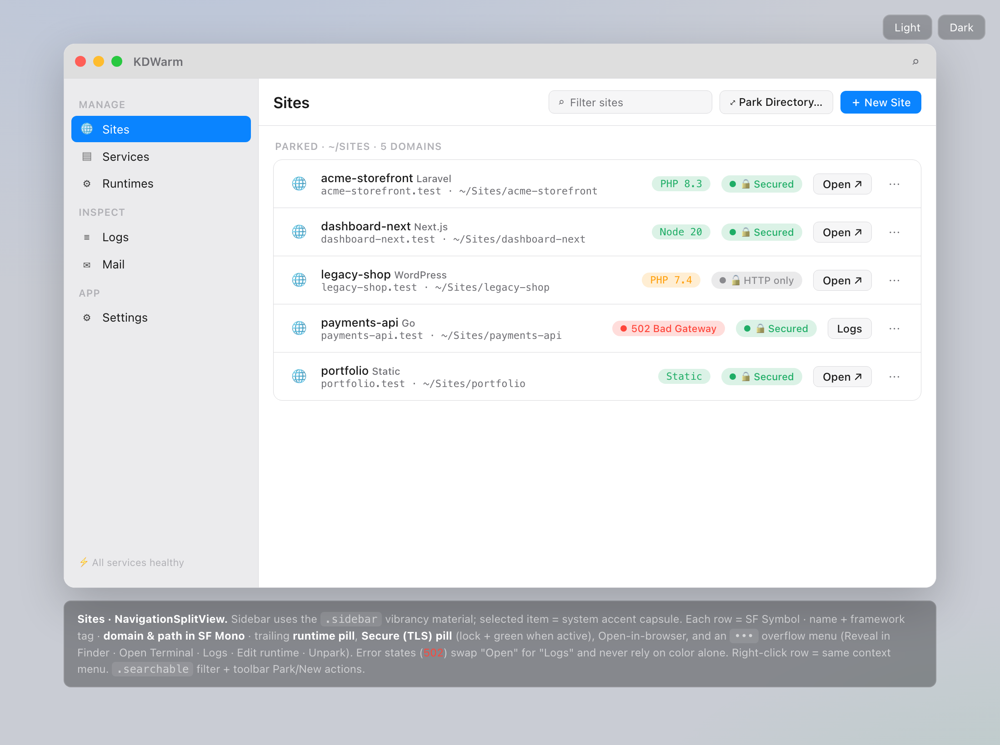
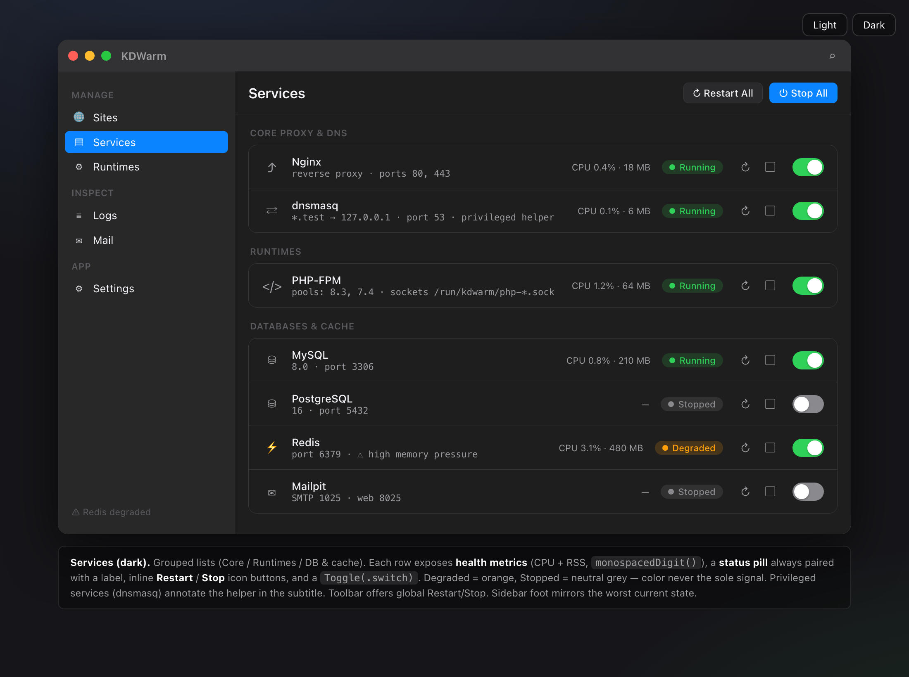
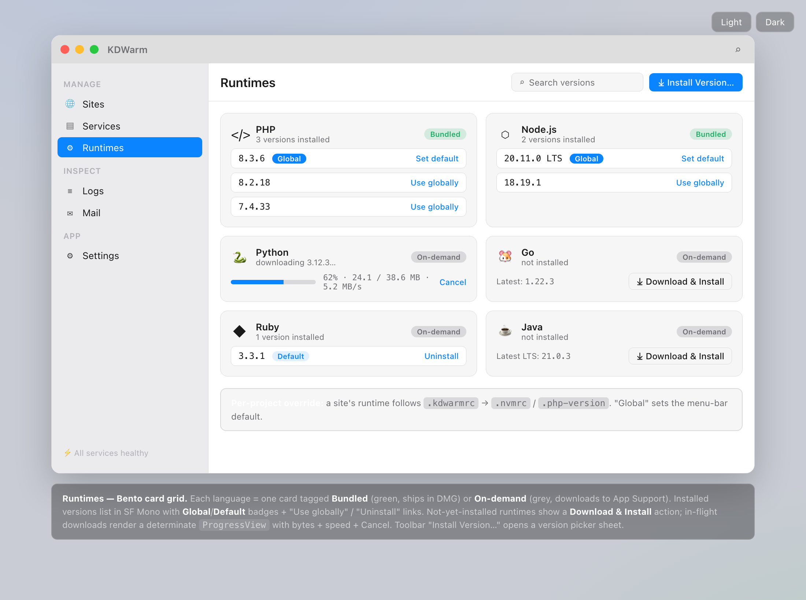
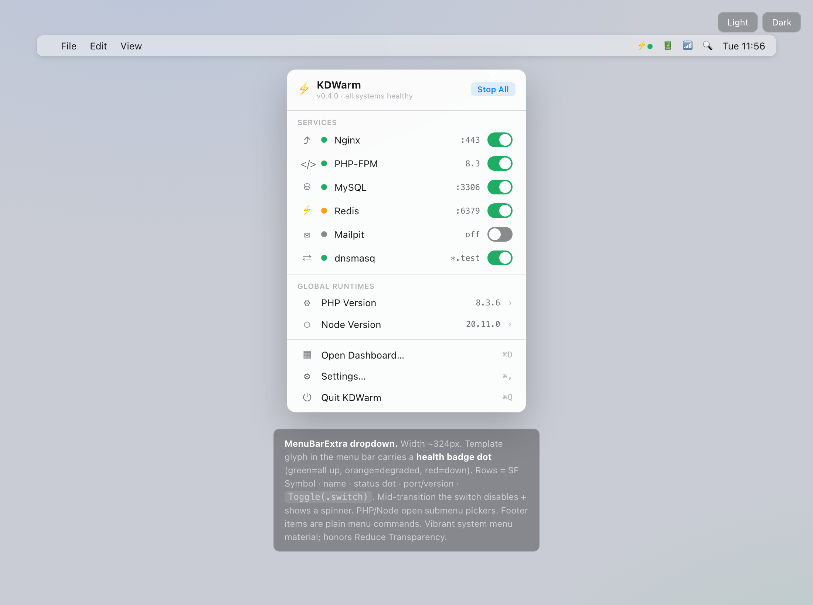

# KTStack

Native macOS local development stack for PHP sites, databases, mail testing, logs, and on-demand language runtimes.

KTStack is the public product name. The source tree and bundle identifiers still use `KDWarm` internally so existing installs, application-support data, and launchd jobs keep working.

<p align="center">
  
</p>



## What It Does

KTStack runs a local development environment directly on macOS, without Docker as the default runtime path. It manages the services and config needed to open projects at local `.test` domains, use trusted local HTTPS, inspect logs, catch outgoing mail, and browse local databases from a native SwiftUI app.

Current release: `0.5.2` (`CURRENT_PROJECT_VERSION` `11`).

## Current Feature Set

| Area | Status |
| --- | --- |
| Native app | Menu-bar SwiftUI app named `KTStack.app` |
| Local sites | Park/import sites under a configurable sites root, default `.test` domains |
| HTTPS | Local TLS vhosts and certificates via the app-managed TLS flow |
| Web server | Nginx vhost generation and PHP-FPM pool generation |
| PHP | On-demand PHP `8.1`, `8.3`, `8.4` runtime releases |
| Other runtimes | On-demand Node.js `22.22.3`, Python `3.12.13`, Go `1.26.4` |
| Services | Nginx, PHP-FPM, dnsmasq, MySQL, PostgreSQL, Redis, MongoDB, Mailpit |
| Database UI | MySQL, PostgreSQL, SQLite, and MongoDB connection flows |
| Mail | Mailpit-backed message list and message preview inside the app |
| Logs | Per-service and per-site log viewer |
| Public sharing | Per-site Cloudflare Tunnel share links through `trycloudflare.com` |
| Updates | Sparkle integration is wired in; release signing/notarization scripts live under `scripts/release/` |

## Screenshots

The images below are real project UI captures stored in this repository under `assets/readme/`.

### Sites


### Services



### Runtimes



### Menu Bar



## How It Works

KTStack keeps application data under:

```text
~/Library/Application Support/KDWarm/
```

The main pieces are:

| Component | Purpose |
| --- | --- |
| `KTStack.app` | Native macOS menu-bar application |
| `KDWarmKit` | Shared framework for service, runtime, site, tunnel, database, mail, and log logic |
| `KDWarmHelper` | Privileged helper target used by the DNS automation path |
| `project.yml` | XcodeGen source of truth for the generated Xcode project |

The generated `KDWarm.xcodeproj` is intentionally ignored. Regenerate it from `project.yml`.

## Local Development

Requirements:

- macOS 13 or newer
- Xcode
- XcodeGen

Install XcodeGen if needed:

```bash
brew install xcodegen
```

Generate the project:

```bash
xcodegen generate
```

Run the framework tests:

```bash
xcodebuild \
  -project KDWarm.xcodeproj \
  -scheme KDWarmKit-Tests \
  -destination 'platform=macOS' \
  test
```

Build the app:

```bash
xcodebuild \
  -project KDWarm.xcodeproj \
  -scheme KDWarm \
  -destination 'platform=macOS' \
  -configuration Release \
  build
```

## Build A DMG

After a Release build, pass the built `.app` to the release script:

```bash
scripts/release/build-dmg.sh \
  ~/Library/Developer/Xcode/DerivedData/KDWarm-*/Build/Products/Release/KTStack.app \
  ./KTStack-0.5.2.dmg
```

The script creates a compressed DMG with `KTStack.app` and an `/Applications` symlink. Developer ID signing and notarization are separate release steps; helper scripts are in `scripts/release/`.

## Repository Layout

```text
KDWarm/                 Native app target and app resources
KDWarmKit/Sources/      Core framework code
KDWarmHelper/           Privileged helper target
KDWarmKitTests/         XCTest suite for framework logic
scripts/                Build, runtime, release, and utility scripts
spikes/                 Local experiments and feasibility probes
assets/readme/          Tracked images used by this README
```

## Notes

- The app is currently macOS-only.
- Runtime downloads are checksum-verified through the manifest in `RuntimeCatalog`.
- MongoDB is fetched on demand and not redistributed inside the app bundle.
- DMG files, generated Xcode projects, plans, docs scratch output, and local agent state are ignored by default.

